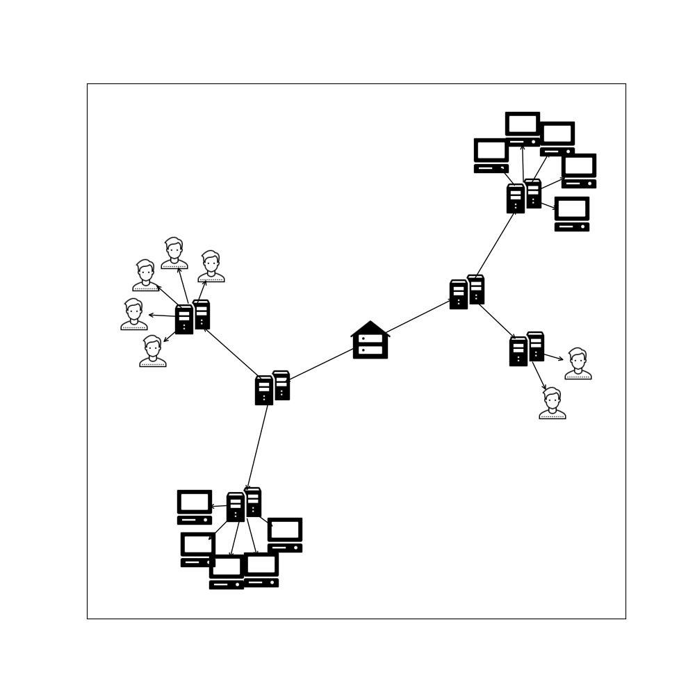

# Active Directory Graph

## Proje Özeti 

  Şirketlerde kullanımı yaygınlaşan Active Directory sistemi getirdiği kolaylıklar yanında gözden kaçan riskleri beraberinde getiriyor. Günümüzde her 39 saniyede bir siber saldırı gerçekleşmektedir. Bunların %94’ü e-mail üzerinden yapılan phishing yöntemi ile yapılmaktadır. Ayrıca 2020 yılı itibariyle fidye yazılımları vakaları %150 artış göstermiştir ve bunlardan en çok etkilenenler işletmeler ve iş kurumlarıdır. Bu kuruluşlar eğer Active Directory üzerine bu saldırılara maruz kalırlarsa tüm sistem tehlikeye girebilmektedir. Oluşan zarar üretimi durdurmaya ve hatta iflasa kadar sürükleyebilmektedir. Projemizin amacı burada devreye girmektedir ve oluşabilecek hasarı en aza indirmeyi amaçlar ve hatta cihazların yetki ve erişimleri üzerinden nasıl bir hasarı oluşabileceğini graph yapısı ile göstermeyi amaçlamaktadır.
  
  
  Active Directory üzerinde yetkilendirme ve erişimleri gösterebilen, olası sızıntılarda erişimi tehlikeye giren kullanıcıları göstererek olası sızıntılara karşı kuruluşların hazır olmasını sağlar. Örneğin A-B-C-D-E cihazları düşünüldüğünde A bilgisayarının yetki ve erişimleri örnek olarak  B - C ve D cihazları olsun bir saldırı planında her zaman daha fazla zarar verebilmek için ana bilgisayar veya yetki ve erişimi daha yüksek olan cihazlar hedeflenmektedir. Böyle bir senaryoda A cihazının elle geçirilmesi durumunda sahip olduğu yetki ve erişimler sayesinde B - C ve D cihazları tehlike altına girmiş olacaktır. Projemiz böyle bir senaryo üzerinde oluşabilecek tehlikeleri göstermeyi ve kullanıcıyı uyarmayı hedefler. Bu sayede sistem yöneticisi oluşabilicek sızıntıları öngörebilir ve hasarı minimuma indirme üzerine yeni bir sistem topolojisi oluşturur.

